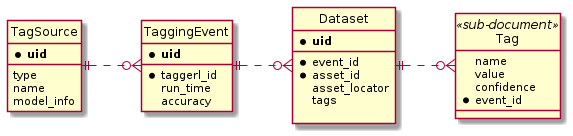

# Tag Service Data Model
The Tag Service persists data in Mongodb. Here we list information about the data model.

## Collections
The Tag Service supports several classes of data, each with its own collection in Mongo:
* model - stores information about a Machine Learning model that is known to the system.
* tagging_event - represents a specific event where tagging of assets occured. An model can have zero or more tagging_events.
* asset_tags - represents all tags for a given asset, storing tag text, confidence and tagging event. The asset_uid relates to any type of asset, but we intend for this to commonly be a bluesky datum object uid.

## Entity Relation Diagram
The following ER Diagram is slighltly modified from traditional ER diagrams to accomodate a document database like Mongo. In some cases, the model uses PK/FK relationship, in others it uses sub-documents to establish relationships.

## Example Documents

    asset_tags = {
        "asset_uid": "ee600210432b8f81ad229c33",
        "sample_id": "house paint 1234",
        "tags": [
            {
                "tag": "rods",
                "confidence": 0.9008,
                "event_id": "wwewere6002104rwerwe81ad229c33",
            },
            {
                "tag": "peaks",
                "confidence": 0.001, 
                "event_id": "wwewere6002104rwerwe81ad229c33",
            }
        ],
    }

    tagging_event = {
        "uid": "wwewere6002104rwerwe81ad229c33",
        "model_id": "dsfosf9080s9uflkwsnerl3k4j",
        "run_time": 1134433.223,
        "accuracy": 0.7776
    }

    model = {
        "model_name": "PyTestNet",
        "uid": "dsfosf9080s9uflkwsnerl3k4j",
        "create_time": 11112333.3  
    }